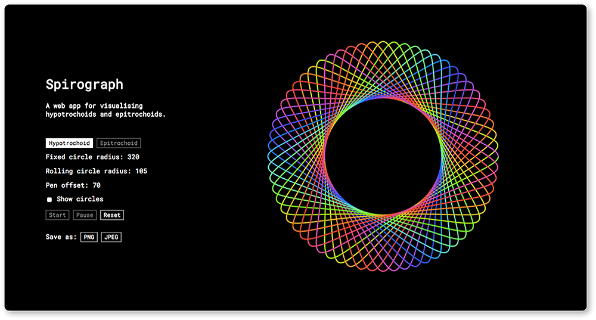
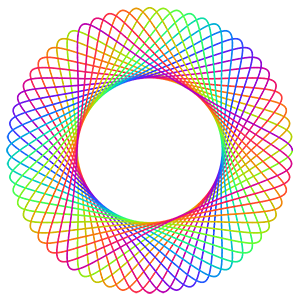
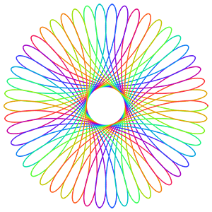
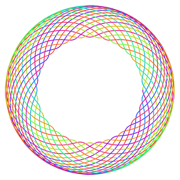
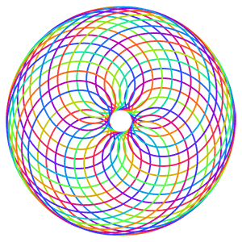

 # [Spirograph](https://faishasj.github.io/spirograph/)
A web app for visualising hypotrochoids and epitrochoids. Sit back and admire plain and simple maths without the fiddly-ness of a real Spirograph toy. Much pretty. Such colour.



## The maths behind the Spirograph
A roulette is the curve traced by a fixed point on a closed convex curve that rolls along another secondary curve without slipping. 

 

[[Source: Wolfram MathWorld]](http://mathworld.wolfram.com/Roulette.html)

The Spirograph toy traces out two kinds of roulettes, namely hypotrochoids and epitrochoids. 

### Hypotrochoids
A hypotrochoid is a roulette in which the fixed point is attached to a circle that rolls **inside** a stationary circle. Thus, the parametric equations for a hypotrochoid are:

```
x = (R - r) * cos(t) + p * cos((R - r) / r * t)
y = (R - r) * sin(t) + p * sin((R - r) / r * t)
```
where `R` is the radius of the stationary circle, `r` is the radius of the rotating circle, and `p` is the distance of the fixed point from the center of the rotating circle. 

 

Screenshots taken with the save image feature.  

### Epitrochoids
An epitrochoid is a roulette in which the fixed point is attached to a circle that rolls along the **outside** of a stationary circle. Thus, the parametric equations for an epitrochoid are:

```
x = (R + r) * cos(t) - p * cos((R + r) / r * t)
y = (R + r) * sin(t) - p * sin((R + r) / r * t)
```

 

For both roulettes, the parametric equations can be split into two terms. The first term (e.g. `(R - r) * cos(t)` for the x-coordinate of a hypotrochoid) expresses the position of the rotating circle. Thus, in the `updateSpiro()` function, we get:

```
posr = {x: mainCanvas.width / 2 + (R-r) * Math.cos(t), y: mainCanvas.height / 2 - (R-r) * Math.sin(t)};
```

for a hypotrochoid, and 

```
posr = {x: mainCanvas.width / 2 + (R+r) * Math.cos(t), y: mainCanvas.height / 2 + (R+r) * Math.sin(t)};
```
for an epitrochoid. This allows us to draw the rotating circle rolling around the stationary circle.

The second term (e.g. `- p * sin((R + r) / r * t` for the y-coordinate of an epitrochoid) expresses the position of the pen relative to the centre of the rotating circle. Therefore, adding the terms gives us the position of the pen relative to the centre of the fixed circle. In the `updateSpiro()` function below the previous lines, we get:

```
posPen = {x: posr.x + p * Math.cos((R-r) / r * t), y: posr.y + p * Math.sin((R-r) / r * t)};
```

for a hypotrochoid, and

```
posPen = {x: posr.x - p * Math.cos((R+r) / r * t), y: posr.y - p * Math.sin((R+r) / r * t)};
```
for an epitrochoid. We can now draw the actual result of the spirograph. 