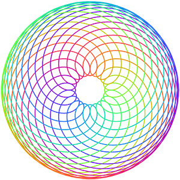

 

 # [Spirograph](https://faishasj.github.io/spirograph/)

A web app for visualising hypotrochoids and epitrochoids. Sit back and admire plain and simple maths without the fiddly-ness of a real Spirograph toy. Much pretty. Such colour.

For the maths behind the Spirograph and/or more screenshots, read my blog post [here!](https://faishasj.github.io/2018/09/11/the-maths-behind-the-spirograph.html)
